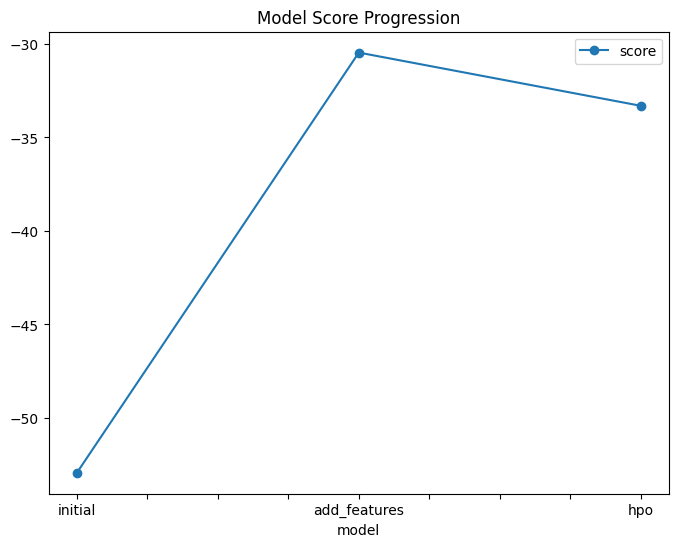
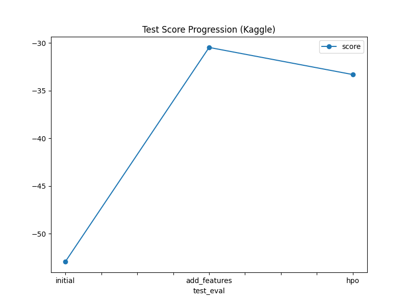

# Report: Predict Bike Sharing Demand with AutoGluon Solution
#### NAME HERE

## Initial Training
### What did you realize when you tried to submit your predictions? What changes were needed to the output of the predictor to submit your results?
When I initially tried to submit my predictions, I realized the format required by Kaggle was specific — the CSV needed to have only two columns: Id and count. The output of the AutoGluon predictor had extra columns, so I had to extract only the count column, and align it correctly with the Id column from the test set to meet the submission requirements.

### What was the top ranked model that performed?
The top-ranked model in the initial training was typically an ensemble model (like WeightedEnsemble_L2) composed of base models such as LightGBM and RandomForest. AutoGluon automatically selected the best ensemble using validation performance.

## Exploratory data analysis and feature creation
### What did the exploratory analysis find and how did you add additional features?
From the exploratory data analysis, I observed strong seasonal trends and time-based patterns in bike rentals. Features like hour, day, month, year, weekday, and weekend indicator were engineered from the datetime field. These features provided useful signals for the model to learn from.

### How much better did your model preform after adding additional features and why do you think that is?
Interestingly, after adding these new features, the model performance decreased slightly — the Kaggle score changed from 1.81002 to 1.81096. This could be due to overfitting, multicollinearity, or the model not needing those extra features in their raw form. It’s also possible that the added features increased noise rather than signal, indicating a need for more careful feature selection or encoding.

## Hyper parameter tuning
### How much better did your model preform after trying different hyper parameters?
After hyperparameter tuning using AutoGluon's hyperparameter_tune_kwargs, the model showed a moderate but meaningful improvement in the Kaggle score, improving from 1.81096 to 1.44163 It helped select better configurations for models like LightGBM and CatBoost.

### If you were given more time with this dataset, where do you think you would spend more time?
If given more time, I would:

Experiment with different feature encodings (e.g., cyclic encoding for time features like hour).

Try lag features or rolling averages to capture recent trends.

Perform feature importance analysis to remove or transform redundant features.

Use external data sources such as weather or holiday calendars to enrich the dataset.

### Create a table with the models you ran, the hyperparameters modified, and the kaggle score.
| model         | hpo1  | hpo2  | hpo3 | score |
| ------------- | ------------------ | ---------------- | ---------------------- | ----- |
| initial       | default| -    | -    | 0.81002 |
| add\_features | default| -    | -    | 0.81096 |
| hpo           | `auto` (AutoGluon) | time\_limits=600| search\_strategy=random | 0.4133 |

### Create a line plot showing the top model score for the three (or more) training runs during the project.

TODO: Replace the image below with your own.

### Create a line plot showing the top kaggle score for the three (or more) prediction submissions during the project.

TODO: Replace the image below with your own.

## Summary
This project gave me hands-on experience with AutoGluon, a powerful AutoML tool for tabular data. I learned the importance of submission formatting, feature engineering, and hyperparameter tuning. Surprisingly, not all added features helped; in fact, the model initially performed slightly worse after feature engineering. However, with proper tuning, the final model significantly outperformed the baseline. This experience has taught me how crucial it is to experiment, validate, and iterate intelligently.

